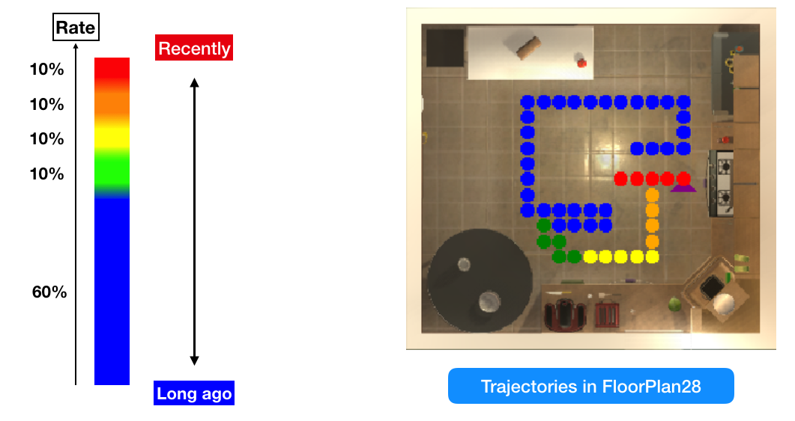

# Challange 2 Solution

## I. Requirements

1. OS: Mac OSX 10.9+, Ubuntu 14.04+.
2. Graphics Card: DX9 (shader model 3.0) or DX11 with feature level 9.3 capabilities.
3. CPU: SSE2 instruction set support.
4. Python 3.6+
6. Linux: X server with GLX module enabled
7. Pip list necessary:
+ matplotlib (version: 3.0.3)
+ pillow (version: 6.0.0)
+ virtualenv (version: 16.5.0)
+ keyboard (version: 0.13.3)
+ ai2thor (version: 1.0.2)
8. ai2thor core file: thor-201904041253-… (491MB)

## II. Installation

1. Clone repository

`git clone https://github.com/sugarless266/robot-uet-spring2019.git`

2. Active virtual environment

`cd robot-uet-spring2019/code`

`source bin/activate`

3. Run code

`sudo python topview.py`

4. Tutorial

* "Left Arrow":  Move agent to the left
* "Right Arrow": Move agent to the right
* "Up Arrow": Move agent to straight ahead
* "Down Arrow": Move agent back
* "R": Rotate agent 90 degree to the right
* "U": Look Up
* "D": Look Down

## III. Group members

+ Phí Văn Minh - 16022411
+ Lê Trung Thông - 16020286
+ Nguyễn Duy Quang - 16020271

